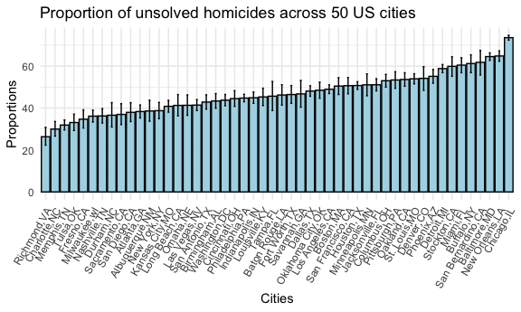
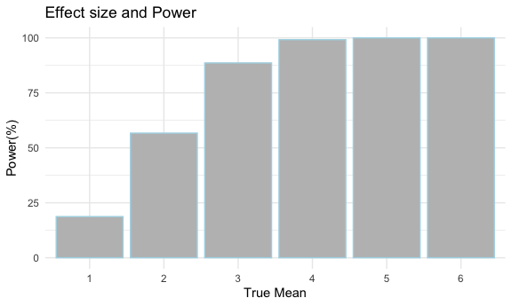
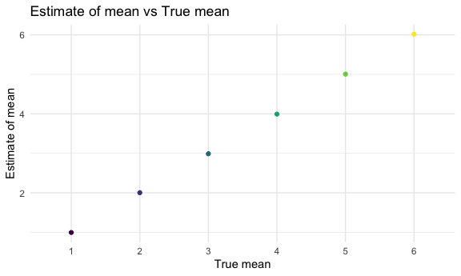
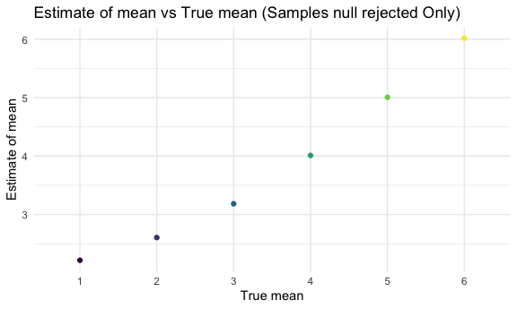

P8105_hw5_mbc2178
================
Melvin Coleman
2022-11-16

### Functions

Let’s define the function to calculate proportions with confidence
intervals in this homework problem. This function will be used in
problem 2.

``` r
  # Prop.test function
prop_fx = function(x,n) {
 
   prop.test(x,n) %>% 
    broom::tidy() %>% 
    
   select(estimate, conf.low, conf.high) %>% 
          mutate(estimate = round(estimate*100, 2),
                  conf.low = round(conf.low*100, 2),
                  conf.high = round(conf.high*100, 2))
}
```

Let’s define the function to perform t-test for a mean(s) and the
p-value arising from a test of null hypothesis =0 using alpha =0.05.
Used `tidy.broom` function to clean output, and round values to 3
digits. This function will be used in problem 3.

``` r
  # T-test function 
  
  ttest_fx = function(true_mu){
    
     sample = rnorm(30, mean= true_mu, sd=5) 
    
    test_results = t.test(x=sample, mu=0) %>% 
      broom::tidy() %>% 
      select(estimate, p.value) %>% 
      
      # Round estimate & p-value to 3 digits
      mutate(
        estimate = round(estimate,3),
        p.value = round(p.value,3)
      )
  }
```

### Problem 1

Let’s import the data in individual csv files from `data/problem_1`. We
create a datafram with the lsit of all files. We `map` over each file’s
path and import the data using `read_csv` and `unnest`.

``` r
study_df = 
  tibble(
    files = list.files("data/problem_1/"),
    path = str_c("data/problem_1/", files)
  ) %>% 
  mutate(data = map(path, read_csv)) %>% 
  unnest()
```

We tidy the resulting dataset and select the variables we need.

``` r
tidy_study = 
  study_df %>% 
  mutate(
    files = str_replace(files, ".csv", ""),
    group = str_sub(files, 1, 3)) %>% 
  pivot_longer(
    week_1:week_8,
    names_to = "week",
    values_to = "outcome",
    names_prefix = "week_") %>% 
  mutate(week = as.numeric(week)) %>% 
  select(group, subjects = files, week, outcome)
```

Let’s create plots with data for each individual, faceted by group.

``` r
tidy_study %>% 
  ggplot(aes(x = week, y = outcome, group = subjects, color = group)) + 
  geom_point() + 
  geom_path() + 
  facet_grid(~group)
```


### Problem 2

Let’s examine the Washington Post’s data on homicides in 50 large U.S.
cities. We will refer to this raw dataset as `homicide_df`.

``` r
homicide_df =
  read_csv('data/homicide-data.csv', col_names = TRUE) 
```

    ## Rows: 52179 Columns: 12
    ## ── Column specification ────────────────────────────────────────────────────────
    ## Delimiter: ","
    ## chr (9): uid, victim_last, victim_first, victim_race, victim_age, victim_sex...
    ## dbl (3): reported_date, lat, lon
    ## 
    ## ℹ Use `spec()` to retrieve the full column specification for this data.
    ## ℹ Specify the column types or set `show_col_types = FALSE` to quiet this message.

The `homicide_df` contains data from 50 large cities in the U.S. with 12
fields or variables and 52179 records or observations. This dataset
includes first and last names as well as ethnicity of homicide victims
(`victim_last`,`victim_first`, `victim_race`), dates of homicide report
(`reported_date`) and the status of cases characterized as closed with
arrest or closed without arrest (`disposition`). In addition, the
dataset also contains the longitude (`lon`) and latitude (`lat`) of the
cities where the homicide occurred.

Let’s perform some cleaning and manipulation on our dataset. We first
create a new variable `city_state` that combines the name of cities and
states.

``` r
homicide_df =
  homicide_df %>% 
  janitor::clean_names() %>% 
  mutate(
    city_state = str_c(city,',',state)) 
```

We now summarize within cities to obtain the total number of homicides
within each city across the U.S. from our dataset. We created a new
dataset called `tot_homicides` containing just two variables;
`city_state` containing the cities across states and `tot_homicides`
containing the total number of homicides per city in the United States.

``` r
tot_homicides =
  homicide_df %>% 
    group_by(city_state) %>% 
    summarise(tot_number_homicides = n()) %>% 
    arrange(desc(tot_number_homicides)) 
```

From our analysis, the city of Chicago has the largest number of total
homicides in the United States with a total of 5,535 homicides. Tulsa,AL
has the least number of homicides, just 1 homicide. This is most likely
a data error as there is no city in the U.S in Alabama named Tulsa and
logically doesn’t make sense that this city would have just 1 homicide
in total.

We now summarize within cities to obtain the total number of unsolved
homicides (those for which the disposition was “Closed without arrest”
or “Open/No arrest”) across the U.S. from our dataset. We replaced all
missing values with 0 for those cities that did not have any cases
closed without arrest and/or open/no arrest. We used the `pivot wider`
function to create a table that’s easier to read with the columns being
the disposition status. We created a new variable called
`total_unsolved_homicides` that summed the dispositions giving us the
total unsolved homicides per city in the US. We called this new dataset
`unsolved_homicides`.

``` r
unsolved_homicides =
  homicide_df %>% 
      group_by(city_state, disposition) %>% 
       filter(disposition %in% c('Closed without arrest', 'Open/No arrest')) %>% 
        summarize(n = n()) %>% 
     
    mutate(
      city_state = as.factor(city_state)) %>% 
        arrange(desc(n)) %>% 
          pivot_wider(
            names_from = disposition,
              values_from = n
  ) %>% 
      janitor::clean_names() %>% 
           replace(is.na(.),0) %>% 
  mutate(total_unsolved_homicides = sum(open_no_arrest, closed_without_arrest))
```

    ## `summarise()` has grouped output by 'city_state'. You can override using the
    ## `.groups` argument.

From our analysis, Chicago has the largest number of unsolved homicides
in the US (4,073) with 3,686 cases still open without any arrest and 387
cases closed without arrest. On the other hand, Tampa has the least
number of unsolved homicides in the US (95) with 87 cases still open
without arrest and 8 cases closed without arrest.

We now merge the two datasets created above, `tot_homicides` and
`unsolved_homicides`. with 50 US cities (Tulsa, AL was ommitted from
newly created dataset) and nested our homicide totals for each city.
This will allow us to perform additional manipulations and answer
specific questions using the variables created from the analysis
conducted to create the datasets. We kept the following variables in the
newly created dataset, `homicide_mrg` : `city_state`,
`total_unsolved_homicides`, `tot_number_homicides`.

``` r
homicide_mrg =
  merge(unsolved_homicides, tot_homicides) %>% 
    select(city_state, total_unsolved_homicides, tot_number_homicides) %>% 
      arrange(desc(tot_number_homicides)) 
```

Now we examine the proportion of homicides that are unsolved for the
city of Baltimore by using the `prop.test` function.`homicide_prop`was
created as a list that contains the proportion estimates and confidence
intervals for each city. We utilize the function created above to run
this procedure making use of `purrr::map` and `unnest` to produce a tidy
dataframe. Output was saved as `prop_baltimore`.

``` r
prop_baltimore =
  homicide_mrg %>% 
  filter(city_state %in% c('Baltimore,MD')) %>% 
  mutate( homicide_prop =
            map2(.x=total_unsolved_homicides, .y=tot_number_homicides, .f=prop_fx)) %>% 
  unnest(homicide_prop) %>% 
  select(estimate, conf.low, conf.high) 
 

prop_baltimore %>% 
   rename('Lower level CI'= conf.low ,
         'Upper Level CI' = conf.high,
         Proportion = estimate)
```

    ## # A tibble: 1 × 3
    ##   Proportion `Lower level CI` `Upper Level CI`
    ##        <dbl>            <dbl>            <dbl>
    ## 1       64.6             62.8             66.3

64.56 of homicides with a confidence interval of 62.76 and 66.32 are
unsolved in the city of Baltimore, MD.

Now we run `prop.test` for each of the cities in our dataset, and
extract both the proportion of unsolved homicides and the confidence
interval for each city. We apply the function created above making use
of `purrr::map` and `unnest` to produce a tidy dataframe.`homicide_prop`
variable was created as a list that contains the proportion estimates
and confidence intervals for each city. Output was saved as
`prop_cities`.

``` r
prop_cities=
  homicide_mrg %>% 
      mutate(homicide_prop =
               map2(.x =total_unsolved_homicides,.y=tot_number_homicides,
                    .f= ~prop_fx(x = .x, n = .y))) %>% 
    unnest(homicide_prop) %>% 
  select(city_state,estimate, conf.low, conf.high)

prop_cities %>% 
    rename('Lower level CI'= conf.low ,
         'Upper Level CI' = conf.high,
         Proportion = estimate,
         City = city_state)
```

    ## # A tibble: 50 × 4
    ##    City            Proportion `Lower level CI` `Upper Level CI`
    ##    <fct>                <dbl>            <dbl>            <dbl>
    ##  1 Chicago,IL            73.6             72.4             74.7
    ##  2 Philadelphia,PA       44.8             43               46.6
    ##  3 Houston,TX            50.8             48.9             52.6
    ##  4 Baltimore,MD          64.6             62.8             66.3
    ##  5 Detroit,MI            58.8             56.9             60.8
    ##  6 Los Angeles,CA        49               46.9             51.1
    ##  7 St. Louis,MO          54.0             51.5             56.4
    ##  8 Dallas,TX             48.1             45.6             50.6
    ##  9 Memphis,TN            31.9             29.6             34.3
    ## 10 New Orleans,LA        64.8             62.3             67.3
    ## # … with 40 more rows

Let’s create a plot that shows the estimates and confidence intervals
for each city adding error bars based on the upper and lower limits of
the confidence interval. Cities are organized according to the
proportion of unsolved homicides

``` r
cities_plot =
prop_cities %>% 
  mutate(city_state = fct_reorder(city_state,estimate)
         ) %>% 
  
  ggplot(aes(x=city_state, y= estimate)) + 
  geom_bar(stat="identity", color="black", fill="lightblue",
           position=position_dodge()) +
  scale_y_continuous(breaks = c(0,20,40,60,80,100)) +
  
  geom_errorbar(aes(ymin =conf.low, ymax= conf.high), width= .2,
                position=position_dodge(.9)) + 
  
  labs(title = "Proportion of unsolved homicides across 50 US cities") +
  xlab("Cities") +
  ylab("Proportions") +
  theme(axis.text.x = element_text(angle = 60, hjust = 1))

cities_plot
```



### Problem 3

In this problem, we conduct a simulation to explore power in a
one-sample t-test. We defined a function above with these fixed
criteria, sample size(n) = 30 and sigma (sd) = 5.

First, we set the mean = 0 and generate 5,000 datasets following a
normal distribution to create a tidy dataframe by making use of
`expand_grid`, `map2` and `unnest` functions. We performed a t-test
setting our null hypothesis = 0 with a 95% confidence interval. We used
the `broom::tidy` function to clean the output of the t-test and saved
the estimated mean and corresponding p-value.

Performed a t-test for a true mean = 0.

``` r
sim_results_zero_df =
  expand_grid(
    true_mu = 0,
    iter = 1:5000
   ) %>% 
  mutate(
    estimate_df = 
      map(.x = true_mu, ~ttest_fx(true_mu = .x))
  ) %>% 
  unnest(estimate_df) 
```

We repeated a similar procedure for true mean = 1,2,3,4,5, and 6.

``` r
sim_multiple_df =
  expand_grid(
    true_mu = 1:6,
    iter = 1:5000
   ) %>% 
  mutate(
    estimate_df= 
      map(.x = true_mu, ~ttest_fx(true_mu = .x))
  ) %>% 
  unnest(estimate_df) 
```

Now, we make a plot showing the proportion of times the null was
rejected (the power of the test) on the y-axis and the true value of the
mean(`true_mu`) on the x axis. A new variable `power` was created from a
`mutate` and `ifelse` statement to specify whether the null was rejected
or not. `power` was divided by the sample size of 5,000 and multiplied
by 100 to find the proportion.

``` r
null_plot =
sim_multiple_df %>% 
  mutate(
    power = ifelse(p.value < 0.05, "rejected", "not_rejected"),
    true_mu = as.factor(true_mu)
  ) %>% 
  group_by(true_mu,power) %>% 
  count(power) %>% 
  
  pivot_wider(
    names_from = power,
    values_from = n
  ) %>% 
  
  mutate(
    percent_rejected = (rejected/5000) * 100
  ) %>% 
  
  ggplot(aes(x = true_mu, y = percent_rejected)) +
  geom_bar(stat= 'identity', color="lightblue", fill="grey",
           position = position_dodge()) +
  
  labs(title = "Effect size and Power") +
  xlab("True Mean") +
  ylab("Power(%)")

null_plot
```



From the graph above, as the true mean increased, the proportion of
times the null was rejected also increased. From the simulation, we can
conclude that as effect size increases, so does power. Furthermore,
after a certain point as observed in the graph from a true mean of 5-6
,the power remains constant as the effect size doesn’t change the
association.

Now, we make a plot showing the average estimate of the mean on the
y-axis and the true value of the mean on the x axis. We used an `ifelse`
function in a `mutate` to create a new variable, `power` that specified
whether the null was rejected or not based on the p-value. We grouped by
the true mean (`true_mu`) and created an interactive plot as seen below.
In the same code chunk, we made another plot with the average estimate
of the true mean only in samples for which the null was rejected on the
y axis and the true value of the mean on the x axis. The same procedure
applied to produce the first plot was used to create the plot below.

``` r
## Plot 1
sim1_plot =
sim_multiple_df %>%
  mutate(
    true_mu = as.factor(true_mu)
  ) %>% 
  group_by(true_mu) %>% 
  summarize(n_obs = n(),
           avg_mean= mean(estimate)) %>% 
  
  ggplot(aes(x = true_mu, y = avg_mean, color = true_mu)) +
  geom_point()  +
  
  labs(title = "Estimate of mean vs True mean") +
  xlab("True mean") +
  ylab("Estimate of mean") +
  theme(legend.position="none")

## Plot 2
sim2_plot =
sim_multiple_df %>% 
  
  mutate(
    power = ifelse(p.value <0.05, "rejected", "not rejected"),
    true_mu = as.factor(true_mu)
  ) %>% 
  filter(power %in% c("rejected")) %>% 
    mutate(
    true_mu = as.factor(true_mu)
  ) %>% 
  group_by(true_mu) %>% 
  summarize(n_obs = n(),
           avg_mean= mean(estimate)) %>% 
  
  ggplot(aes(x=true_mu, y= avg_mean, color = true_mu)) +
    geom_point() +
  
  labs(title = "Estimate of mean vs True mean (Samples null rejected Only)") +
  xlab("True mean") +
  ylab("Estimate of mean") +
  theme(legend.position="none")

## Output interactive plots
sim1_plot
```



``` r
sim2_plot
```



The sample average of the mean across tests for which the null is
rejected are approximately equal to the true mean values of 3,4, 5 and 6
only. This is because when we have a large sample size, we expect the
true mean to approximate the estimated mean. In addition, with a large
sample size and a large effect size, we expect to reject the null
hypothesis more often compared to a small effect size and/or sample
size.
